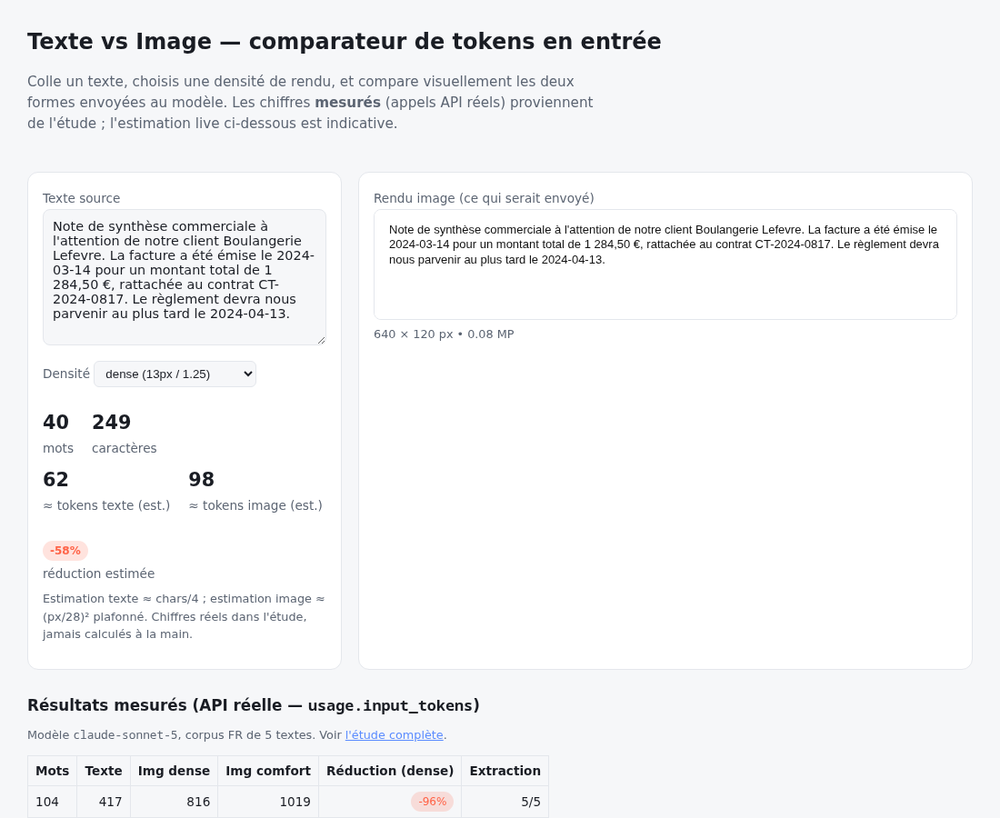

# Texte vs Image en entrée : coût réel en tokens

Un modèle facture le texte via un tokenizer BPE (≈ 1 token / 4 caractères),
mais une image via des **patches** de 28×28 pixels (≈ `largeur×hauteur / 750`
tokens). Envoyer un document **sous forme d'image** peut donc coûter moins de
tokens en entrée qu'en texte brut — mais pas toujours, et pas sans risque de
lecture. Ce dépôt le **mesure** au lieu de l'estimer.

## Résultats mesurés (pas d'estimation)

Tous les coûts viennent du champ `usage.input_tokens` renvoyé par l'API
(`claude-sonnet-5`), sur un corpus FR de 5 textes (~100 → 3000 mots), extraction
de 5 champs structurés notée contre une vérité terrain.

| Longueur | Texte (tokens) | Image dense (tokens) | Réduction | Fiabilité |
|---------:|---------------:|---------------------:|----------:|:---------:|
| 104 mots  | 417  | 816  | **-96 %** (perd) | 5/5 |
| 303 mots  | 923  | 816  | +12 % | 5/5 |
| 606 mots  | 1688 | 816  | +52 % | 5/5 |
| 1201 mots | 3189 | 1460 | +54 % | 5/5 |
| 3010 mots | 7763 | 1621 | +79 % | 5/5 |

- **L'image dense devient rentable à partir de ~300 mots** ; en dessous elle
  coûte plus cher que le texte.
- **Fiabilité** : texte brut = 5/5 partout. L'image = 5/5 partout **sauf** le
  texte long en preset `comfortable`, qui doit être réduit sous la limite API de
  8000 px → extraction à **2/5** (mot perdu, date manquée, valeur hallucinée).
  Le meilleur gain de coût est aussi le seul échec de lecture.

👉 **[Étude complète et limites → `study/results.md`](study/results.md)**

## Démo live

**[▶ Ouvrir le comparateur](tool/index.html)** *(100 % front-end, aucun backend)* —
colle un texte, choisis la densité, compare le rendu image et les tokens.
Une fois GitHub Pages activé : `https://<user>.github.io/<repo>/tool/`.



## Structure

```
study/   script de mesure, corpus, résultats bruts (CSV/JSON), results.md, graphes
tool/    index.html — la démo
README.md
```

## Reproduire les mesures

```bash
python3 -m venv .venv && . .venv/bin/activate
pip install -r study/requirements.txt
python -m playwright install chromium

cd study
python build_corpus.py          # 5 textes FR + vérité terrain
python render.py                 # PNG dense + comfortable (Playwright)
export ANTHROPIC_API_KEY=sk-...  # appels API réels
python measure.py                # -> results.csv / results.json
python analyze.py                # -> fig_reduction.png / fig_tokens.png
```

## Limites

Échantillon minuscule (5 textes, 1 domaine, 1 langue, 1 modèle, 1 appel par
cellule), rendus PNG synthétiques (pas de scans bruités). Tendances indicatives,
pas de valeur statistique — voir `study/results.md`.
