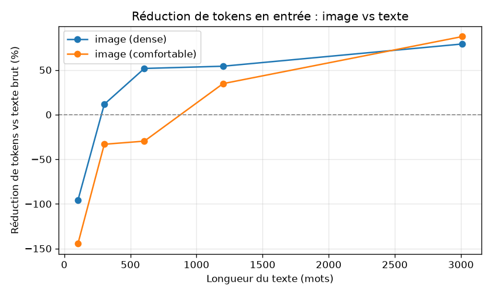
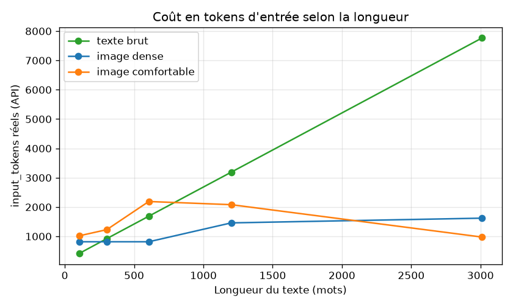

# Texte vs Image en entrée : coût réel en tokens et fiabilité de lecture

Étude mesurée (pas d'estimation) du coût en **`input_tokens`** et de la
**fiabilité d'extraction** lorsqu'on envoie le même contenu à un modèle
Claude sous deux formes : **texte brut** ou **image du texte**.

Tous les chiffres de coût proviennent du champ `usage.input_tokens` renvoyé
par l'API. Aucun n'est calculé par une formule locale.

---

## 1. Méthodologie

- **Modèle** : `claude-sonnet-5` (un seul modèle — voir limites).
- **Corpus** : 5 textes en français, longueurs croissantes (~100, 300, 600,
  1200, 3000 mots), chacun contenant 5 champs structurés connus à l'avance
  (nom client, date de facture, montant TTC, référence de contrat, date
  d'échéance). Généré par `build_corpus.py`, vérité terrain dans
  `corpus/corpus_truth.json`.
- **Rendu image** : chaque texte est rendu en PNG en headless (Playwright /
  Chromium) via `render.py`, avec **2 presets** qui ne diffèrent que par la
  police, l'interligne et les marges (texte source identique) :
  - `dense` : 13 px, interligne 1,25, page 640 px.
  - `comfortable` : 18 px, interligne 1,8, page 820 px.
- **Appels réels** (`measure.py`) : pour chaque texte, 3 modes d'entrée
  (`text`, `img_dense`, `img_comfort`) avec la **même instruction fixe**
  demandant les 5 clés en JSON. On enregistre `usage.input_tokens` et on
  compare les valeurs extraites à la vérité terrain.
- **Contrainte API** : une image dont une dimension dépasse **8000 px** est
  refusée. Les images concernées sont réduites avant envoi (drapeau
  `img_downscaled`) — cas rencontré sur le texte 5 en preset `comfortable`.
- **Scoring de fiabilité** : chaque champ est normalisé (espaces, format de
  date, séparateurs de montant) puis comparé — on mesure si le modèle a **lu
  la bonne valeur**, indépendamment du format.

Données brutes : `results.csv`, `results.json`.

---

## 2. Résultats bruts

| Texte | Mots | Mode | Image (px) | MP | Réduit ? | `input_tokens` | Réduction vs texte | Extraction |
|------:|-----:|------|-----------|----:|:---:|--------------:|------------------:|:---:|
| 1 | 104 | text | - | - | | 417 | - | 5/5 |
| 1 | 104 | img_dense | 640×162 | 0.104 | non | 816 | **-95.7 %** | 5/5 |
| 1 | 104 | img_comfort | 820×372 | 0.305 | non | 1019 | **-144.4 %** | 5/5 |
| 2 | 303 | text | - | - | | 923 | - | 5/5 |
| 2 | 303 | img_dense | 640×422 | 0.270 | non | 816 | +11.6 % | 5/5 |
| 2 | 303 | img_comfort | 820×987 | 0.809 | non | 1229 | -33.2 % | 5/5 |
| 3 | 606 | text | - | - | | 1688 | - | 5/5 |
| 3 | 606 | img_dense | 640×812 | 0.520 | non | 816 | +51.7 % | 5/5 |
| 3 | 606 | img_comfort | 820×1894 | 1.553 | non | 2189 | -29.7 % | 5/5 |
| 4 | 1201 | text | - | - | | 3189 | - | 5/5 |
| 4 | 1201 | img_dense | 640×1576 | 1.009 | non | 1460 | +54.2 % | 5/5 |
| 4 | 1201 | img_comfort | 820×3643 | 2.987 | non | 2081 | +34.7 % | 5/5 |
| 5 | 3010 | text | - | - | | 7763 | - | 5/5 |
| 5 | 3010 | img_dense | 640×3883 | 2.485 | non | 1621 | +79.1 % | 5/5 |
| 5 | 3010 | img_comfort | 820×8955 | 7.343 | **oui** | 977 | +87.4 % | **2/5** |

---

## 3. Conclusions (limitées à ce que les données montrent)

**Où l'image gagne en coût.** Sur ce corpus et ce modèle, l'image en preset
`dense` devient moins chère que le texte brut à partir de **~300 mots**
(+11.6 %), et l'écart se creuse avec la longueur : +54 % à 1200 mots, +79 % à
3000 mots. Le texte brut croît linéairement en tokens (417 → 7763), alors que
le coût image dense plafonne bien plus bas (816 → 1621).

**Où l'image perd.** En dessous de ~100 mots, l'image coûte **plus cher** que
le texte (jusqu'à -144 % en `comfortable`) : le coût fixe d'une image dépasse
celui d'un texte court. Le preset `comfortable` ne devient rentable qu'à
partir de ~1200 mots ; en dessous il perd systématiquement.

**Effet de la densité.** À contenu identique, `dense` coûte toujours moins que
`comfortable` (moins de pixels → moins de tokens). Les petites images denses
touchent un plancher (~816 tokens) indépendant de la longueur jusqu'à ~600
mots.

**Fiabilité — le compromis clé.** Le texte brut donne **5/5 sur les 5 textes**.
L'image donne aussi 5/5 partout **sauf** le texte 5 `comfortable`, qui a dû
être réduit sous 8000 px pour respecter la limite API : l'extraction tombe à
**2/5**. Erreurs concrètes observées sur ce cas :

- `nom_client` : « Transports Baptiste Girard » lu « Baptiste Girard » (mot perdu).
- `date_facture` : non trouvée (champ vide).
- `date_echeance` : **hallucination** « 30 jours » au lieu de « 2024-11-14 ».

Autrement dit, le « meilleur » gain de coût du tableau (87.4 %) est aussi le
seul cas où la lecture échoue : le gain vient de la réduction d'image, qui
dégrade la lisibilité du texte long.

**Recommandation opérationnelle (bornée au corpus).** Pour de l'extraction de
champs : le texte brut reste le choix sûr si le coût n'est pas contraignant.
L'image dense est intéressante en coût au-delà de ~300 mots **tant que**
l'image reste sous la limite de 8000 px sans réduction agressive ; au-delà,
paginer/découper le document plutôt que de réduire une image trop haute.

---

## 4. Limites explicites

- **Échantillon minuscule** : 5 textes, 1 domaine (notes commerciales), 5
  champs. Pas de valeur statistique — tendances indicatives seulement.
- **Un seul modèle** (`claude-sonnet-5`) et **une seule langue** (français).
- **Un seul appel par cellule** : pas de mesure de variance/répétabilité.
- **Rendu synthétique** : PNG propres générés à partir de texte, pas de scans
  bruités, photos, ni documents multi-colonnes réels.
- **Tokens image dépendants du pré-traitement API** (redimensionnement,
  découpage) que nous ne contrôlons pas ; les chiffres valent pour les images
  telles qu'envoyées ici.
- Ne pas extrapoler au-delà de ces conditions.
